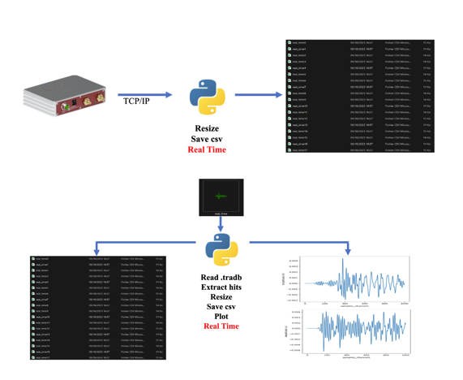
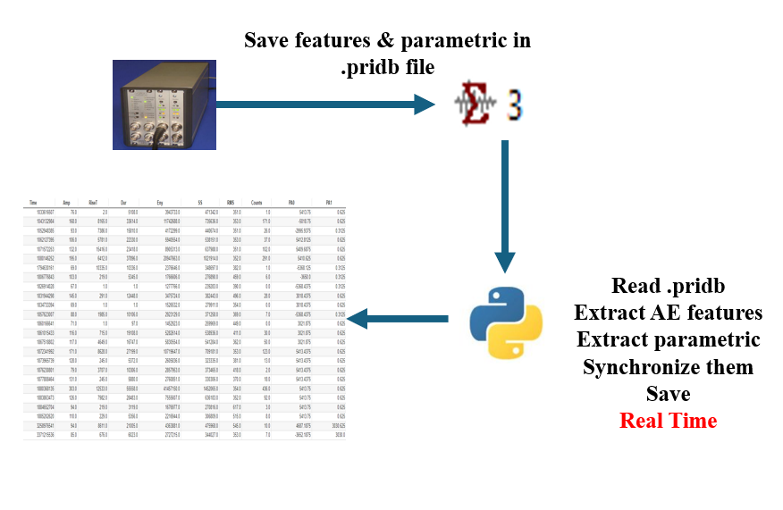
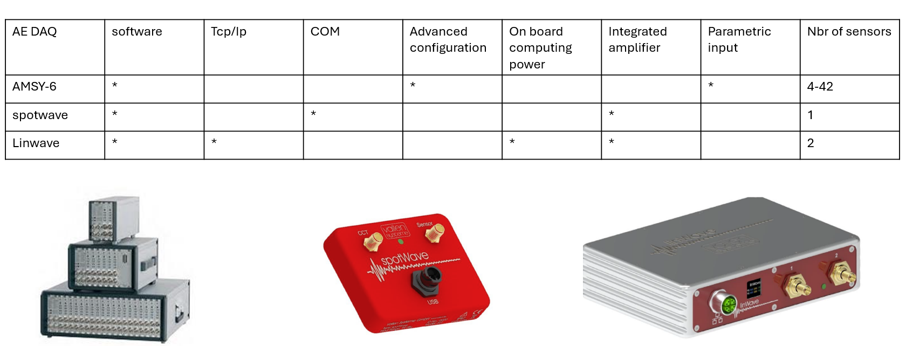
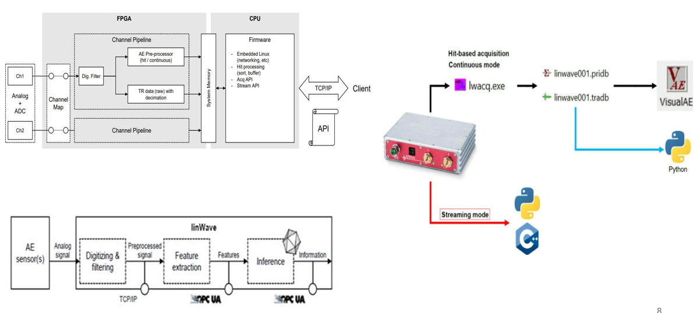
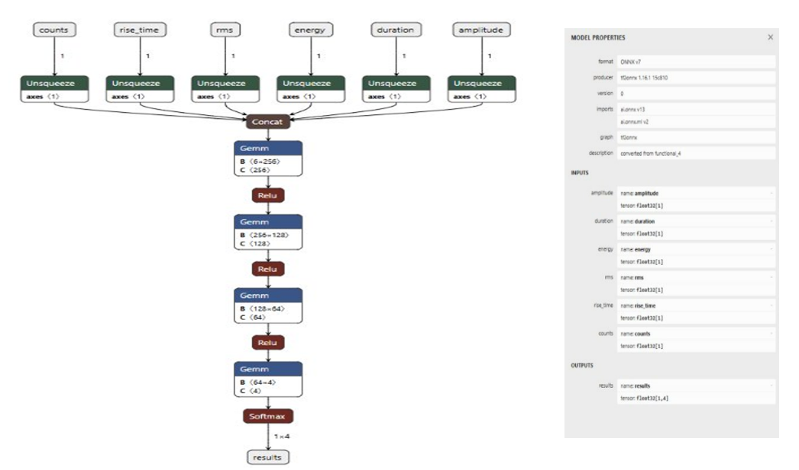
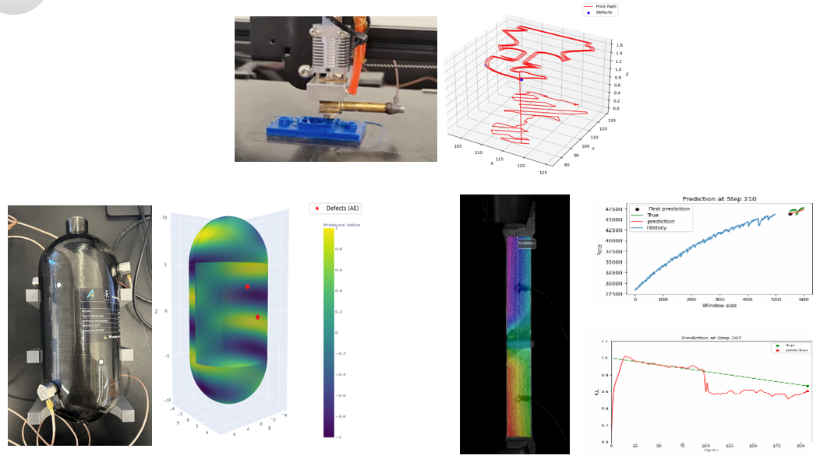

# vallen

## Linwave
The approach was to extract the raw waveforms of the hits to save them or plot them and preprocess them to be an input for AI model.
We were able to achieve that by reading the .tradb file in real time or using the TCP\IP protocol to collect data directly from the device.

## AMSY-6
The approach was to extract the AE-features and the external parametric to synchronize them an save them in real time.
We were able to achieve that by reading the .pridb file in real time. Unlike the Linwave, we can’t get data directly from the device, we need to read from the SQLite.

## ONNX

We leverage the real-time capabilities of the Vallen systems to extract features from acoustic emission (AE) signals and sensor data for early defect detection and failure prediction. Deep learning models, including LSTMs, are trained to classify nozzle vibrations, detect anomalies in material flow, and identify microcracks or deformation under varying pressures. By correlating AE wave patterns, hit frequencies during fatigue tests, and readings from load and strain sensors, the models can forecast failure points, detect force drops or threshold crossings, and provide accurate, real-time insights into material behavior and print quality.

